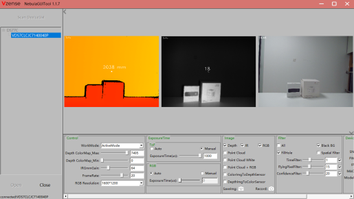

# 看图软件NebulaGuiTool

NebulaGUITool是基于Nebula SDK开发的图形界面工具，提供Depth图像彩色映射显示、3D点云显示、滤波参数调节、设备参数设置以及RGB & Depth对齐等功能。

对于Ethernet类产品，可通过设置页面对设备进行IP地址设置与固件升级操作。

 

NebulaGUITool下载链接：

国内： 

[https://gitee.com/Vzense/NebulaGUITool ](https://gitee.com/Vzense/NebulaGUITool )

海外： 

https://github.com/Vzense/NebulaGUITool

## 安装使用

////待添加。。。

## 功能介绍

打开相机效果图：

