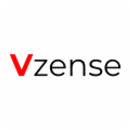

**维感科技介绍**

**工业级3D ToF感知技术领跑者**

团队自2016年开始从事三维图像，计算机视觉，图像处理，传感器融合，手势和面部识别等研究，并结合团队优势，

将3D ToF (Time-of-Flight)感知技术的应用与解决方案定制化确定为公司的长期发展方向。

Nebula SDK是基于Vzense 产品提供的软件开发包，

该开发包目前适用于Windows、Linux、ARM Linux操作系统，

为应用开发者提供一系列友好的API 和简单的应用示例程序。

 [NebulaSDK 介绍](./README.md)