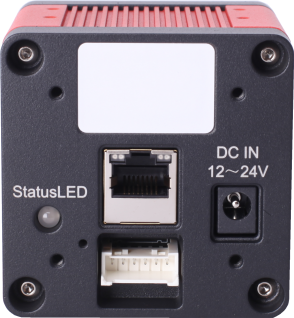
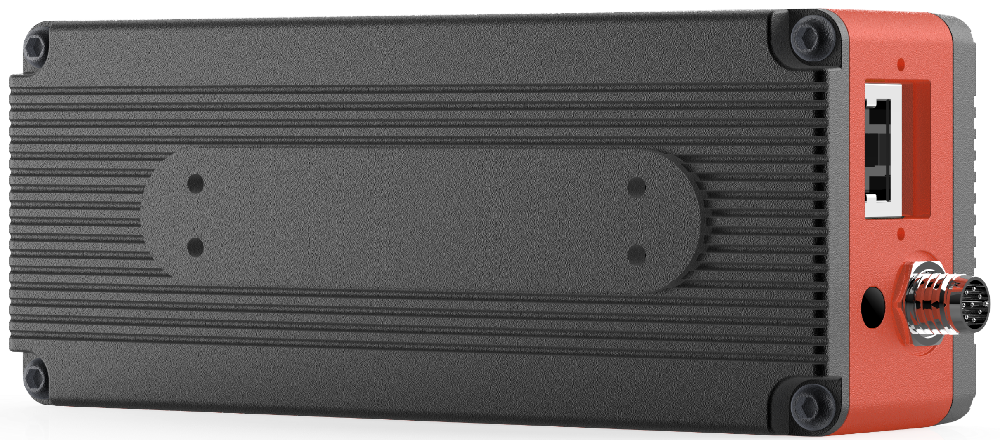

# 支持产品

目前Nebula SDK支持的产品有：

- DS77 Lite/Pro
- DS77C Lite/Pro
- DS86 & DS87

## 1 DS77 Lite/Pro

HTML 格式：

<table border="1">
    <tr>
        <td></td>
        <td></td>
        <td></td>
    </tr>
    <tr>
        <td><strong>Model</strong></td>
        <td align="center"><strong>DS77 Lite</strong></td>
        <td align="center"><strong>DS77 Pro</strong></td>
    </tr>
    <tr>
        <td><strong>Sensor</strong></td>
        <td colspan="2" align="center">SONY DepthSense ToF</td>
    </tr>
    <tr>
        <td><strong>Laser</strong></td>
        <td colspan="2" align="center">940nm VCSEL * 2</td>
    </tr>
    <tr>
        <td><strong>TOF Resolution</strong></td>
        <td colspan="2" align="center">640 * 480, Max. 25fps</td>
    </tr>
    <tr>
        <td><strong>TOF FOV</strong></td>
        <td colspan="2" align="center">70°(H) * 50°(V)</td>
    </tr>
    <tr>
        <td><strong>Pixel Format</strong></td>
        <td colspan="2" align="center">12bit Depth, 8bit IR</td>
    </tr>
    <tr>
        <td><strong>Digital Interface</strong></td>
        <td colspan="2" align="center">1000M Ethernet, RS485</td>
    </tr>
    <tr>
        <td><strong>Power Supply</strong></td>
        <td align="center">12V ~ 24V DC</td>
        <td align="center">12V ~ 24V DC or POE+</td>
    </tr>
    <tr>
        <td><strong>Accuracy</strong></td>
        <td colspan="2" align="center">&lt; 1% (4mm@1m)</td>
    </tr>
    <tr>
        <td><strong>Detect Range</strong></td>
        <td colspan="2" align="center">0.15m ~ 5m</td>
    </tr>
    <tr>
        <td><strong>Operating Temperature</strong></td>
        <td colspan="2" align="center">-20℃ ~ 50℃</td>
    </tr>
    <tr>
        <td><strong>OS Support</strong></td>
        <td colspan="2" align="center">Windows, Linux, Arm Linux</td>
    </tr>
    <tr>
        <td><strong>Software Support</strong></td>
        <td colspan="2" align="center">Nebula SDK, C++, C, Python</td>
    </tr>
    <tr>
        <td><strong>Ingress Protection</strong></td>
        <td align="center">IP42</td>
        <td align="center">IP67</td>
    </tr>
</table>

markdown 格式：

|   |      |  |
| ------------------------- | -------------------------- | ------------------------ |
| **Model**                 | **DS77 Lite**              | **DS77 Pro**             |
| **Sensor**                | SONY DepthSense ToF        |                          |
| **Laser**                 | 940nm VCSEL * 2            |                          |
| **TOF Resolution**        | 640 * 480, Max. 25fps      |                          |
| **TOF FOV**               | 70°(H) * 50°(V)            |                          |
| **Pixel Format**          | 12bit Depth, 8bit IR       |                          |
| **Digital Interface**     | 1000M Ethernet, RS485      |                          |
| **Power Supply**          | 12V ~ 24V DC               | 12V ~ 24V DC or POE+     |
| **Accuracy**              | < 1% (4mm@1m)              |                          |
| **Detect Range**          | 0.15m ~ 5m                 |                          |
| **Operating Temperature** | -20℃ ~ 50℃                 |                          |
| **OS Support**            | Windows, Linux, Arm Linux  |                          |
| **Software Support**      | Nebula SDK, C++, C, Python |                          |
| **Ingress Protection**    | IP42                       | IP67                     |

## 2 DS77C Lite/Pro

|  |          |  |
| :---------------------- | ------------------------------- | ----------------------- |
| **Model**               | **DS77C Lite**                  | **DS77C Pro**           |
| **Sensor**              | SONY DepthSense ToF + RGB       |                         |
| **Laser**               | 940nm VCSEL * 2                 |                         |
| **TOF Resolution**      | 640 * 480, Max.25fps            |                         |
| **RGB Resolution**      | 1600 * 1200, Max.25fps          |                         |
| **TOF FOV**             | 70°(H) * 50°(V)                 |                         |
| **RGB FOV**             | 77°(H) * 55°(V)                 |                         |
| **Pixel Format**        | 12bit Depth, 8bit IR, MJPEG RGB |                         |
| **Digital Interface**   | 1000M Ethernet, RS485           |                         |

## 3 DS86 & DS87

|         |                        |   |
| :---------------------------- | -------------------------------------------- | ----------------------- |
| **Model**                     | **DS87**                                     | **DS86**                |
| **Sensor**                    | SONY DepthSense ToF CMOS                     |                         |
| **Laser**                     | 940nm VCSEL * 2                              |                         |
| **TOF Resolution/Frame rate** | 640 * 480, Max. 15fps                        |                         |
| **ToF HDR Mode**              | Supported with Max. 10fps                    |                         |
| **ToF FOV**                   | 70°(H) * 50°(V)                              |                         |
| **RGB Camera**                | 1600 * 1200, , Global Shutter, 77°(H)*55°(V) |                         |
| **Output Format **            | RAW12(Depth, IR) + JPG(RGB)                  |                         |
| **Interface**                 | 1000Mbps Ethernet and RS485                  |                         |
| **Physical Connection**       | Aviation Plug x 2                            | RJ45x1 8pin Connectorx1 |
| **Power Supply**              | PoE+ or 12V~24V (DC)                         | 12V~24V (DC)            |
| **Accuracy**                  | < 1%                                         |                         |
| **Working Range**             | 0.15m ~ 5m                                   |                         |
| **Working Temperature**       | -20°C to +50°C                               |                         |
| **Operation System&Platform** | Windows/Linux/Arm Linux/ROS1/ROS2            |                         |
| **SDK**                       | C/C++/Python                                 |                         |
| **Enclosure Rating**          | IP67                                         | IP42                    |
| **Conformity**                | CE, FCC, FDA                                 |                         |