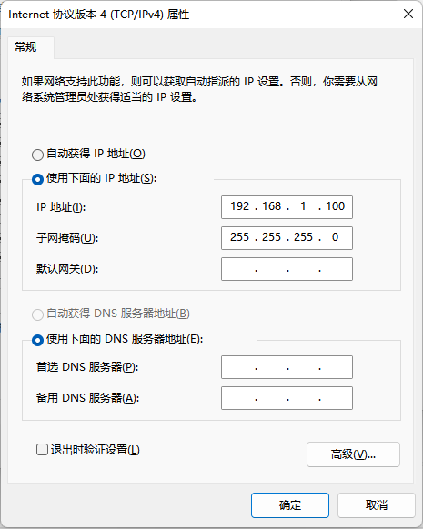
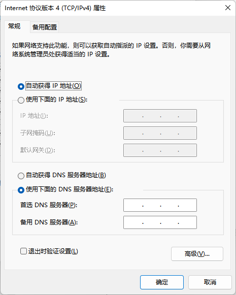

# 安装

## 1 推荐系统配置

| **配置项** | **推荐配置**                       |
| ---------- | ---------------------------------- |
| 操作系统   | Win7 32/64位 Win10 64位 Win11 64位 |

## 2 设备连接

图 1 模组安装示意图

网线连接分为固定地址直连与DHCP连接两种方式。DS77系列产品默认使用固定IP地址方式连接，如需更改IP地址、子网掩码、DHCP，可以使用[NebulaGUITool](https://gitee.com/Vzense/NebulaGUITool)进行更改。

### 2.1  固定地址

固定地址连接可以相机与电脑直连，也可以配置在同一网段的交换机中使用。

直连：一端连接相机，另一端连接PC主机的网线接口。相机默认IP为192.168.1.101，在PC端将“本地连接”的，子网掩码设为255.255.255.0，IP地址设为同一网段（如192.168.1.100）。

图 2 固定地址方式

### 2.2  DHCP

DHCP连接方式，需要将相机连接在开启DHCP功能的路由器上，使用在相同局域网中的PC进行连接。设置相机DHCP的方法，请参考[NebulaGUITool](https://gitee.com/Vzense/NebulaGUITool)的文档。推荐将PC的“本地连接”设置为自动获取IP地址。

图 3.3 DHCP方式
注意：

1. PC端使用的网卡、路由器、交换机都要满足千兆要求。
2. 在首次运行SDK时，要为使用SDK的应用设置通过系统防火墙的权限，如下图所示。

图 3.4 防火墙配置

