# Nebula SDK使用说明

## 1 Nebula SDK目录结构

Nebula SDK包含Bin，Document，Include，Lib，PrecompiledSamples，Samples等目录。

Windows目录结构如下图所示：
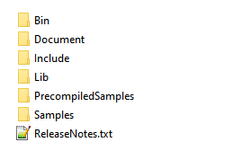
图 4.1 Windows SDK目录结构

- Bin包含Nebula SDK的动态链接库。
- Document包含Nebula SDK的说明文档。
- Include包含Nebula SDK的通用头文件
- Lib包含Nebula SDK的导入库文件
- PrecompiledSamples包含部分预编译实例程序，可用来预览产品的深度图像、IR灰度图像、Color图像。 
- Samples包含已支持产品的诸多例程：其中一部分为基础API调用示例；另一部分为基于OpenCV第三方库，进行深度图、IR灰度图、RGB图预览，切换等功能的示例。示例采用VS2017做为构建工具。

## 2 开发流程

### 2.1 项目配置

Windows下使用Visual Studio 2017开发。新建应用项目工程，设置工程属性，将Include目录添加到包含目录中，将Lib目录添加到库目录中。另外，需要将Nebula_api.lib添加到附加依赖项中。可参考Samples中的项目配置。

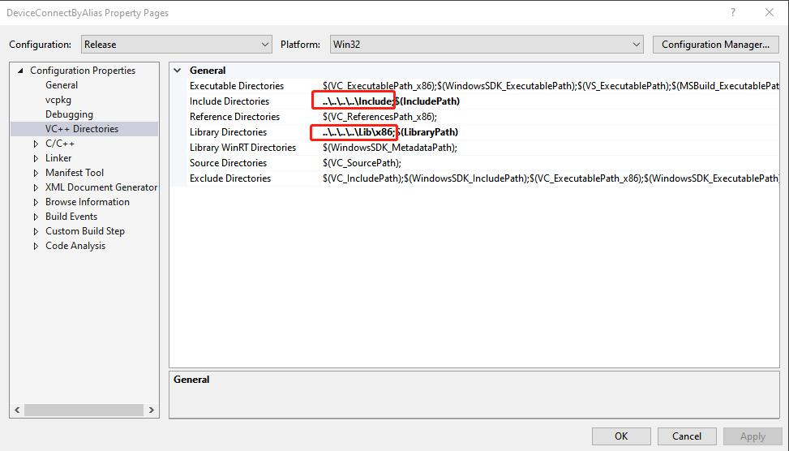
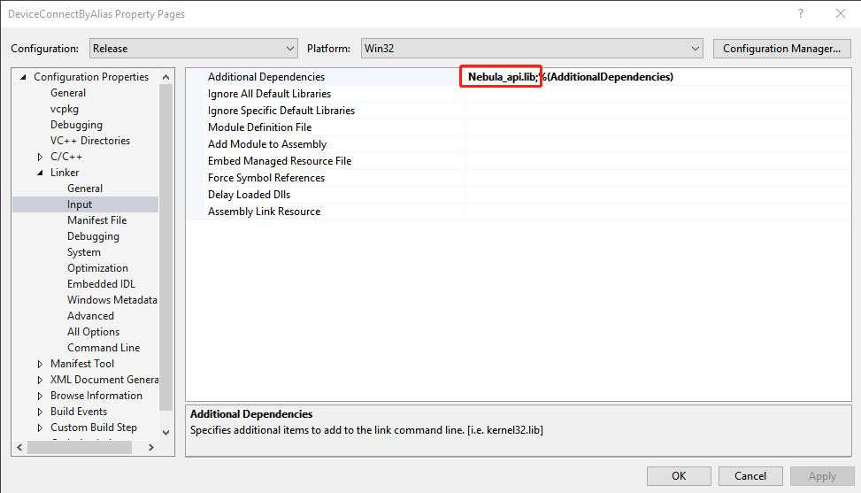
图 4.2 SDK开发项目配置

### 2.2 接口调用流程

Nebula SDK的API接口调用流程，请参考如下流程图：

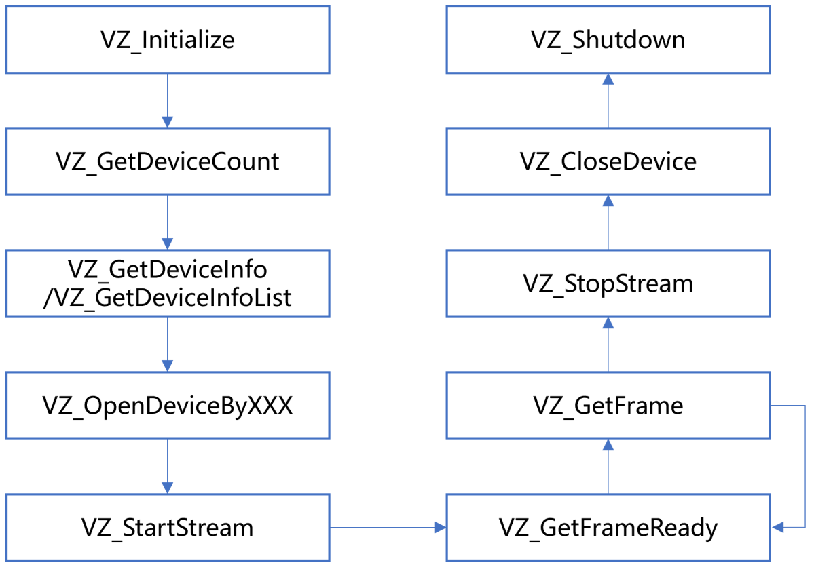
图 4.3 SDK接口调用流程

1. **VZ_Initialize 和 VZ_Shutdown**

VZ_Initialize：初始化SDK。

VZ_Shutdown：注销SDK，释放SDK创建的所有资源。

1. **VZ_GetDeviceCount、VZ_GetDeviceInfoList/VZ_GetDeviceInfo**

VZ_GetDeviceCount：获取当前连接的设备数，请确保此接口返回的设备数量大于0，再进行后续接口的调用。

VZ_GetDeviceInfoList / VZ_GetDeviceInfo：获取当前连接的设备信息。

1. **VZ_OpenDeviceByXXX和VZ_CloseDevice**

VZ_OpenDeviceByXXX：打开指定的深度摄像头设备，支持使用URI、别名、IP地址三种方式打开相机。

VZ_CloseDevice：关闭指定设备。

1. **VZ_StartStream和VZ_StopStream**

VZ_StatrStream：打开指定设备图像数据流

VZ_StopStream：关闭指定设备图像数据流。

1. **VZ_GetFrameReady和VZ_GetFrame**

在图像处理的主循环里，每次先调用VZ_GetFrameReady采集一帧图像，然后再调用VZ_GetFrame获取指定图像类型的一帧图像数据。

1. **Set和Get**

SDK提供了丰富的Set和Get类型的接口，以便设置与获取相机属性、参数和数据等各类功能，详见5.3节。

## 3 SDK Sample 使用流程

Nebula SDK开发包提供的Sample用于演示SDK的API接口使用，位于SDK目录的Samples文件夹下。包含如下内容：

- Base：SDK基础API调用Sample集合
- OpenCV：配合第三方库OpenCV的Sample

### 3.1 基础例程

基础例程介绍SDK的单个特性API接口的使用。为了使用户可以快速的熟悉使用，例程根据产品进行分类，如DS77、DS77C等。例程包含打开图像数据流、图像获取、软/硬触发、点云转换与保存等API接口的使用。

1. 从Gitee/GitHub下载Nebula SDK

> git clone [https://gitee.com/Vzense/NebulaSDK](https://gitee.com/Vzense/NebulaSDK)
> 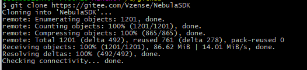
> 图4.4 下载Nebula SDK

1. 根据实际产品选择对应的sample，以DS77C为例编译DeviceConnectByAlias

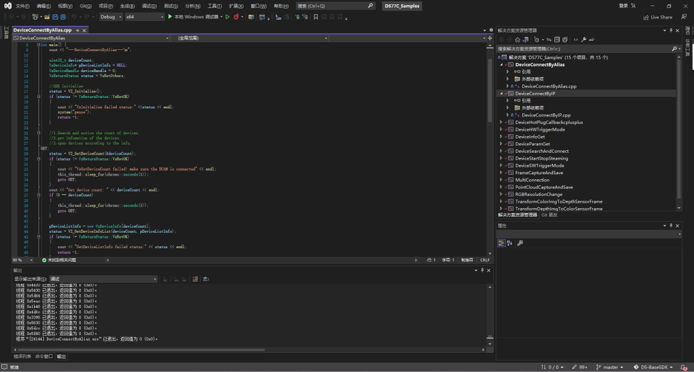
图4.5 编译例程

1. 编译完成，调试运行。结果如下图：

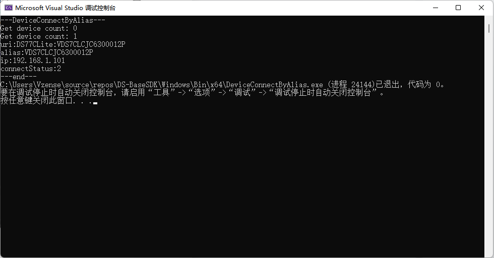
图 4.6 运行完成

### 3.2  OpenCV例程

1. 到OpenCV官网，下载并安装[OpenCV 3.0.0](https://opencv.org/release/opencv-3-0-0/)。

 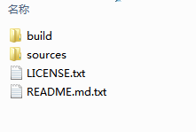
图 4.7 OpenCV3.0.0下载安装

1. 设置环境变量OPENCV_DIR， 其值为安装的OpenCV的build目录的绝对路径。例如D:\Programs\OpenCV300\opencv\build。

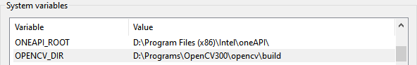
图 4.8设置OPENCV_DIR环境变量

2. 根据实际产品选择对应的sample。下面以DS77C为例，使用Visual Studio 2017打开NebulaSDK\Windows\Samples\OpenCV\DS77C目录下的FrameViewer.vcxproj，直接编译。

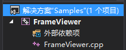
图 4.9 FrameViewer工程

3. 编译生成的可执行文件FrameViewer.exe在NebulaSDK\Windows\Bin\x86\或NebulaSDK\Windows\Bin\x64\目录下。

4. 运行FrameViewer.exe，执行效果如下图。

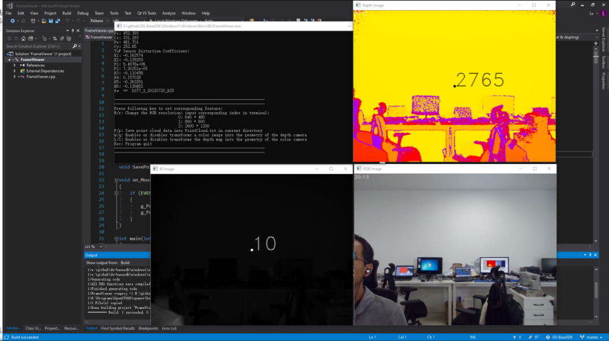
图4.10 运行成功